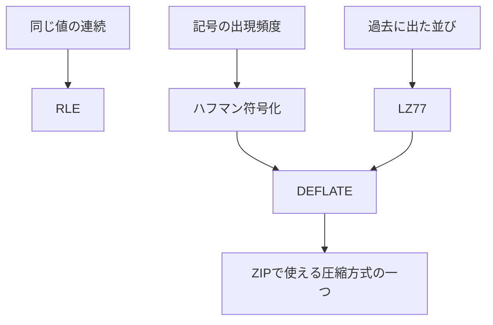

# 通信士の豆知識：RLEと圧縮技術の歴史

## 実装した読みもの

ホーム、チュートリアル、ゲームの「通信士の豆知識」から同じ解説を読める。本文はアプリに同梱し、出典リンクを開く場合だけ外部サイトへ移動する。

- **RLEの仕組み**：ラン＝同じ値が連続する区間。`AAAAAA → (6,A) → AAAAAA`で圧縮と復元を示す。
- **なぜ最初にRLEを学ぶのか**：規則が目で見える、復元まで手で追える、得意・不得意を比較できる、という本ゲームの教材選定理由。
- **技術の位置づけ**：RLEは連続、ハフマン符号化は出現頻度、LZ77は過去の並びに注目する。単純な新旧の優劣や一本道の進化として説明しない。
- **歴史の年表**：可逆圧縮に関係する論文・仕様書の記録を抜粋する。圧縮技術の全史ではない。

初期表示は短いRLEの説明と例に留め、理由・位置づけ・歴史は独立した開閉欄にする。任務2について、無圧縮でクリアすることもデータに合った判断だと説明する。

## 表現上の注意

- 「RLEから学ぶ」は本ゲームの学習順。RLEが最初に発明された圧縮方式だとは説明しない。
- RLEの発明年・発明者は断定しない。1992年はTIFF 6.0仕様の発行年で、RLEの発明年ではない。
- 1996年はRFC 1951の公開年で、DEFLATEの発明年ではない。
- 1組2 Bはゲーム独自形式。PackBitsは連続とそのままコピーする区間を分けるなど、記録形式が異なる。
- 可逆圧縮の例から、JPEGなどの非可逆圧縮まで同じ規則だと一般化しない。
- 別方式の実装・実ファイルの保存・ZIPの展開は、引き続き今後の学習範囲。

## 出典と確認内容

確認日：2026-09-16。本文は出典の要約と、本ゲームの教育上の説明で構成する。

| 記録 | 確認内容 | 一次資料 |
| --- | --- | --- |
| 1948年 Shannon | 通信と情報の数学的な扱い、効率的な符号化と情報量の関係。原論文§9参照。 | [A Mathematical Theory of Communication（原論文PDF）](https://www.princeton.edu/~wbialek/rome/refs/shannon_48.pdf)、[Bell Labsの書誌情報](https://www.nokia.com/bell-labs/publications-and-media/publications/a-mathematical-theory-of-communication/) |
| 1952年 Huffman | 出現確率に応じた符号の構成、平均符号長の最小化。発行年月はRFC 1951 §5の書誌でも確認。 | [A Method for the Construction of Minimum-Redundancy Codes（原論文PDF）](https://www.cse.iitd.ac.in/~pkalra/siv864/huffman_1952.pdf)、[RFC 1951 §3.2.1・§5](https://www.rfc-editor.org/rfc/rfc1951.html) |
| 1977年 Ziv・Lempel | 過去の出力を保持したバッファから、位置と長さで並びをコピーする方式。原論文冒頭の発行年月・著者と説明を確認。 | [A Universal Algorithm for Sequential Data Compression（原論文PDF）](https://pzs.dstu.dp.ua/ComputerGraphics/ic/bibl/ziv_lempel_1977.pdf) |
| 1992年 TIFF 6.0 | §9「PackBits Compression」、本文42ページ。ランレングス方式の実用例と、そのままコピーする区間の扱い。 | [TIFF 6.0（ITU掲載の仕様書PDF）](https://www.itu.int/itudoc/itu-t/com16/tiff-fx/docs/tiff6.pdf#page=42) |
| 1996年 RFC 1951 | 文書公開は1996年5月。§2でDEFLATEがLZ77とハフマン符号化を組み合わせると説明。 | [DEFLATE Compressed Data Format Specification version 1.3](https://www.rfc-editor.org/rfc/rfc1951.html) |

## 実装と確認

共通コンポーネントは`src/components/CompressionGuide.tsx`。ゲーム・チュートリアルでは記事の開閉やリンク操作時に再生を停止し、入力・組・再生位置を保持する。自動で再開しない。ネイティブの開閉欄を使い、キーボードとタップで操作できる。

`e2e/compression-guide.spec.ts`で、オフラインでの本文表示、ホームからの導線、PC・スマートフォン幅、記事操作時の再生停止、入力保持を確認する。外部出典サイトの可用性はブラウザテストの成功条件にしない。

## 次の拡張方針（合意済み・画面への追加は今後）

学習順はRLE → LZ77の考え方 → ハフマン → 組み合わせ → ZIP。既存の年表に、学習順と次の関係図を併記する。RLE章の次にLZ77を学ぶ理由は、`ABCABCABC`の並びの繰り返しへ自然につながるためと説明する。

この図は技術の役割と組み合わせの関係。発明順は年表で別に示す。DEFLATEの関係は[RFC 1951 §2](https://www.rfc-editor.org/rfc/rfc1951.html#section-2)、ZIPの複数方式・無圧縮格納・DEFLATE利用は[PKWARE ZIP仕様 §4.1.3・§4.1.7](https://pkware.cachefly.net/webdocs/casestudies/APPNOTE.TXT)を出典とする。ZIP仕様は前の議論時に確認済み。
